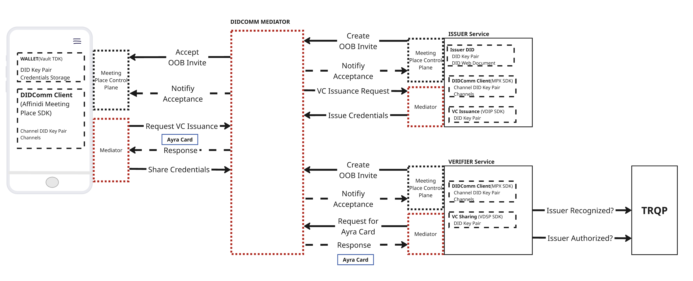
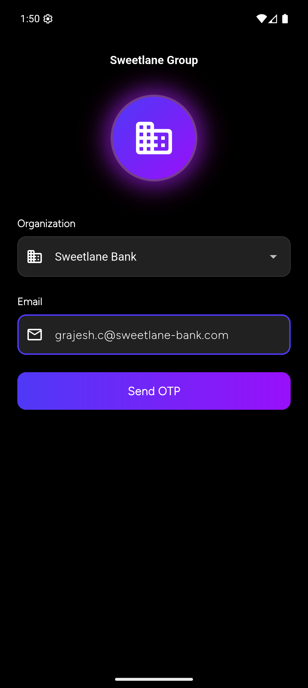
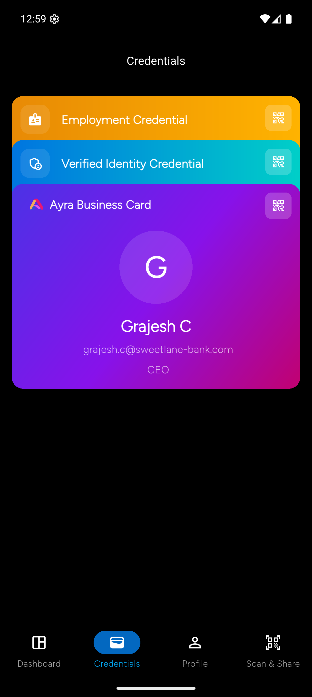
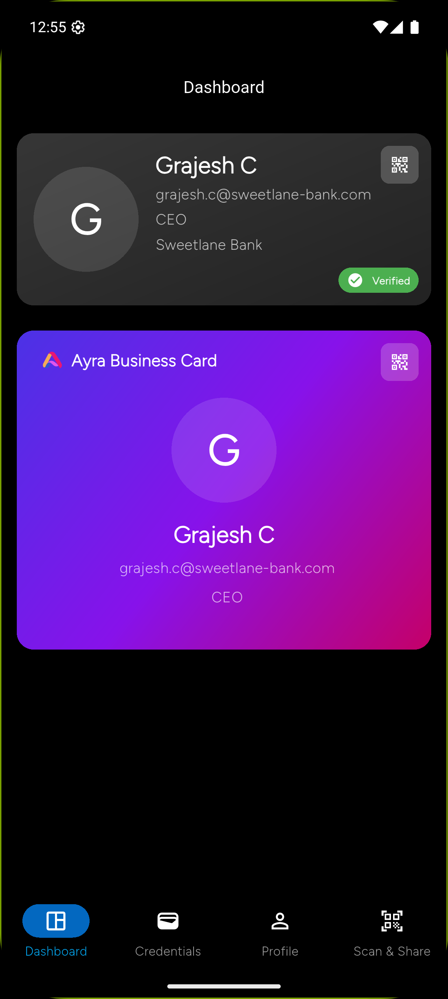
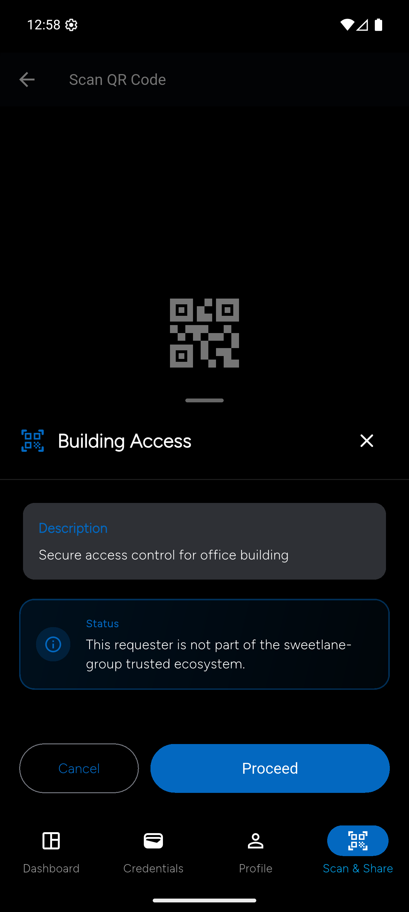
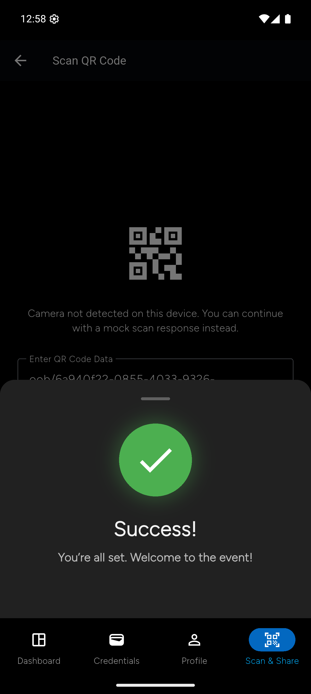
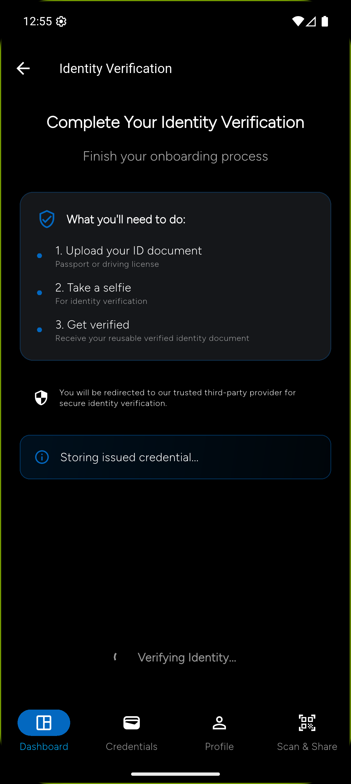

# Ayra Card Demonstration, built with Affinidi OSS toolkits

The [Ayra Card concept](https://docs.ayra.forum/ayra-cards) standardizes how we interact to share trusted information across ecosystems. This concept is developed and supported by [the Ayra Association](https://ayra.forum/about/) - a Swiss neutral, non‑profit, multi‑stakeholder foundation dedicated to building digital trust ecosystems and operationalising [Trust Over IP](https://trustoverip.org/). 

**This repository showcases this concept in action** specifically demonstrating how it brings together two key aspects:
- **Technical trust**: Cryptographic validation
- **Human trust**: Governance frameworks

Affinidi is proud to be [a strategic member of the Ayra Association](https://ayra.forum/members/), offering Affinidi Trust Infrastructure (ATI), which includes a collection of open-source toolkits that help developers quickly and easily realise complex concepts, such as the Ayra Card.

## 📖 Table of Contents
- [Overview](#-overview)
- [Scenario](#bulb-scenario-sweetlane-group)
- [Architecture](#%EF%B8%8F-architecture)
- [Core Application Components](#-core-application-components)
- [Prerequisites](#-prerequisites)
- [Quick Start](#-quick-start)
- [Security Considerations](#-security-considerations)
- [Additional Documentation](#-additional-documentation)
- [Demo Video](#-demo-video)
- [Maintenance, Troubleshooting, Contributing & Support](#-maintenance-troubleshooting-contributing--support)
- [License](#-license)
- [Acknowledgments](#-acknowledgments)
- [Using the Application](#-using-the-application)


## 🎯 Overview

This repository demonstrates how **Ayra Card** bootstraps trusted digital interactions across systems using interoperable building blocks.

Ayra Card acts as a **container of containers** packaging identity, cryptographic keys, service endpoints, governance context, and shared information into a single artifact that any relying party can use to
**start an interaction now** and decide what to trust and how to proceed. This makes Ayra Card a practical starting point for digital interaction, rather than a closed credential or platform‑specific format.

It is intentionally **payload‑independent** enabling **mixed-trust model** by design: a Card can carry high‑assurance Verifiable Credentials (VC 2.0) from any ecosystem, simple self‑declared details (like an email or phone number), **URLs or pointers** into existing systems, and even **just queries** that request what’s needed next (means to the end). The Card doesn’t dictate *what* must be trusted; it standardizes *how trust begins and grows*.

Use this demo to run an end‑to‑end flow locally, see how recognition and authorization can be checked at runtime, and explore how Ayra Card makes trust **portable, progressive, and repeatable** without bespoke integrations.

## :bulb: Scenario: Sweetlane Group

Sweetlane Group is a fictional, global, multi‑national organization used to demonstrate how Ayra Card enables trusted digital interactions without pre‑existing integrations or bilateral agreements.

**Goal**: Show how a Sweetlane employee can use one digital Ayra Card to participate in multiple trusted relationships across office access, benefits, and commerce without relying on point integrations. 
- Access Sweetlane Offices globally
- Receive local promotions at Coffee shop 
- Obtain employee rates at hotels

In this example, The Ayra Card carries a simple but powerful signal: this person is backed by Sweetlane Group. That association can be recognized wherever it matters. All without APIs, public discount codes, or direct system integrations. Relying parties verify authorisation and recognition at runtime via TRQP to make trust decisions in the context of the usecase.

#### The Model

1. [TRQP compliant Trust Lists](https://trustoverip.github.io/tswg-trust-registry-protocol/) — DNS for trust: structured queries that resolve authority and recognition across contexts.
1. [W3C VC 2.0](https://www.w3.org/TR/vc-data-model-2.0/) — attestations as tamper‑evident, verifiable evidence that can be checked anywhere.
1. [Ayra Business Card](https://docs.ayra.forum/ayra-cards/concepts/ayracard-credentialtypes/ayra-businesscard) — a standardized way to carry recognition so trust travels with the data.

<br>

## Connecting trust across ecosystems 

#### A simple story: “Two lists, one card, no headaches”

Think of it like this: there are **two trusted lists**.

**List #1: Sweetlane’s list (their own world)**

Sweetlane keeps a list of:
- which companies are really part of Sweetlane Group
- and which ones are “trusted” for certain things (like issuance of Ayra Card)

So Sweetlane offices don’t need to track every employee everywhere.
When someone shows an Ayra Card, the office system just asks: _“Is this person currently backed by Sweetlane Group at the level we require to open this door?”_

That’s it.

<br>

**List #2: Ayra’s list (the outside world)**

Now picture a coffee shop and a hotel.
They don’t know Sweetlane.
They don’t want to know Sweetlane.
Just like a shop doesn’t need to understand how Visa works.

They simply trust Ayra’s rules and process, and ask: _“Do we trust the network behind this card?”_

If Ayra says, _“Yes, Sweetlane is a recognized network,”_ then the coffee shop and hotel can safely treat the employee as eligible without calling Sweetlane, without shared codes, without integrations.

<br> 

**This is what changes the game:**
- Sweetlane can issue once (under its own rules).
- Any business can decide later (based on the trust they accept).
- Trust becomes something you can check, not something you have to guess.

So the employee gets:
- office access
- a local coffee perk
- a hotel employee rate

…with the same card, because everyone is relying on trusted lists, not custom connections.

<br> 

> ### Key idea
> One card, many contexts.
The Ayra Card packages the first step of trust—identity, endpoints, governance context, and shared information. From there, TRQP and VC 2.0 enable progressive assurance, raising confidence only when required without bespoke integrations or shared secrets.
>
> This is not connecting systems. This is connecting trust.

<br> 

## 🏗️ Architecture

### Conceptual Architecture

Ayra Card ecosystem follows the **Trust Triangle** with governance model where three primary roles interact to establish and verify trust:

1. **Issuer**: Trusted entity (e.g., Sweetlane Group) that issues verifiable credentials to Holders *via the **Issuer Portal***.
2. **Holder**: User (e.g., Employee) who holds credentials and presents them to Verifiers *using the **Mobile Wallet app***.
3. **Verifier**: Relying party (e.g., Building Security) that requests and verifies credentials from Holders *using the **Verifier Portal***.

All three parties rely on the relevant **Trust Registry** to anchor trust, ensuring that Issuers are authorized and governance rules are followed without needing direct integrations.

<p align="center">
  
</p>
<p align="center">
  <em>Trust triangle with governance</em>
</p>


### Deployment Architecture

<p align="center">
  
</p>

<p align="center">
  <em>High-level architecture diagram showing the components involved and their interactions/flows</em>
</p>

## 🔧 Core Application Components

#### 1. Endpoint Manager (Domain Setup folder)

Generates secure, public URLs for local services (Issuer, Verifier, Trust Registry) using ngrok tunnels, specifically for development and testing purposes. Automatically updates all related configuration files to ensure components communicate using the correct endpoints. Optional—developers may configure public domains manually or use alternative tunneling solutions.

#### 2. Issuer Service

  Server application (Dart) for issuing employment credentials and Ayra business card credentials to users.

  - Generates organization did:web identifiers
  - Securely issues Employee and Ayra Business Card credentials to mobile wallets via [the Verifiable Data Issuance Protocol (VDIP)](https://github.com/affinidi/affinidi-vdxp-docs) (based on DIDComm v2.1)


#### 3. Verifier Service Portal

Server application (Dart) for requesting and verifying credentials in multiple real-world scenarios (building access, session entry, hotel check-in, coffee shop discounts) using [the Verifiable Data Sharing Protocol (VDSP)](https://github.com/affinidi/affinidi-vdxp-docs) (built on DIDComm v2.1).

- **Building Access** - Verify credentials for building entry
- **6th Floor Session** - Secure area access for roundtable sessions
- **Hotel Check-in** - Fast check-in with identity credentials
- **Coffee Shop** - Exclusive discounts with Ayra card

Generates scenario-specific QR codes that employees scan with the mobile app to share relevant verifiable credentials.

#### 4. Trust Registry API

Rust-based API service implementing the [Trust Registry Query Protocol (TRQP)](https://trustoverip.github.io/tswg-trust-registry-protocol/#introduction) specification using [Affinidi's open-source implementation](https://github.com/affinidi/affinidi-trust-registry-rs). This is used for querying trusted issuer registrations and supported credential types. Serves as a domain specific governance mechanism enabling authorization and trust checks for an ecosystem.

#### 5. Trust Registry UI

React-based web interface for interacting with the Trust Registry API. Allows administrators and developers to register trusted issuers, manage credential schemas, and test registry queries during development.

#### 6. Mobile App

Flutter mobile wallet application for end users. Leverages Affinidi Meetingplace SDK and TDK for secure storage, receipt, and sharing of credentials. Supports organization bootstrapping, receiving credentials via VDIP, personalized Ayra card claiming, and presenting credentials by scanning QR codes from verifier portals (via VDSP). Features:

- **Login** - Organization selection with email + OTP authentication
- **Credential Issuance** - Receive employment credentials via VDIP
- **Ayra Card Claiming** - Customize and request business card credentials
- **Scan & Share** - Scan QR codes and share credentials via VDSP

## 📋 Prerequisites

Before you begin, ensure you have the following:

- Docker (version 20.10 or later): [Install Docker Desktop & ensure Docker daemon is running](https://www.docker.com/products/docker-desktop/)
- Docker Compose (optional, for advanced setups)
- Rust (version 1.91 or later)
- Node.js (version 18 or later) & npm: [Install Node.js](https://nodejs.org/)
- Flutter SDK (version 3.0 or later): [Install Flutter](https://docs.flutter.dev/get-started/install)
- Bash shell (macOS/Linux) or compatible shell environment
- Git (for cloning repositories)
- ngrok Account (for public domain tunnelling): [Sign up for ngrok](https://dashboard.ngrok.com/signup) & Get your [auth token](https://dashboard.ngrok.com/get-started/your-authtoken); Free tier is sufficient for development


## 🚀 Quick Start

### Part 1: Set up Foundational Trust Infrastructure

Ayra Card relies on secure messaging middleware to enable trust. Before running the demo, you need to set up this **Foundational Trust Infrastructure** using open source components.

#### Step 1: Deploy DIDComm Mediator (The Postman)

This component routes secure messages between parties.
- Follow the guide: [Deploy DIDComm Mediator](https://docs.affinidi.com/products/affinidi-messaging/didcomm-mediator/deployment-options/)
- **Outcome**: You will get a `MEDIATOR_DID`

#### Step 2: Deploy Meeting Place Control Plane (The Address Book)
This component manages secure connections.
- Follow the guide: [Deploy Meeting Place Control Plane](https://docs.affinidi.com/products/affinidi-messaging/meeting-place/deployment-options/)
- **Outcome**: You will get a `SERVICE_DID`


<br>

> [!TIP]
> **What you should have:** Before proceeding to Part 2, ensure you have these three values ready:
> - `MEDIATOR_DID`: `did:web:your-domain.com:mediator`
> - `SERVICE_DID`: `did:web:your-domain.com:service`
> - `NGROK_AUTH_TOKEN`: `2abc...xyz` (from [ngrok dashboard](https://dashboard.ngrok.com/get-started/your-authtoken))

<br>


### Part 2: Set up Application

The repository includes all component code in their respective `code/` folders (issuer-portal, verifier-portal, trust-registry-ui, mobile-app). Only the Trust Registry API will be cloned from GitHub during setup.

#### Step 1: Run the Setup Script

The setup script automates the entire configuration process:

```bash
chmod +x setup-ayra.sh
./setup-ayra.sh
```

**What the script does:**

- Creates `.env` file from `.env.example` if not present
- Prompts for required credentials (`SERVICE_DID`, `MEDIATOR_DID`, `NGROK_AUTH_TOKEN`)
- Clones Trust Registry API repository from GitHub (only external dependency)
- Runs individual setup scripts for each component
- Generates ngrok tunnels and updates all configurations
- Prepares services for deployment

**Interactive Prompts:**

```
⚠️  SERVICE_DID is not set in .env file
Please enter SERVICE_DID: did:web:example.com:service

⚠️  MEDIATOR_DID is not set in .env file
Please enter MEDIATOR_DID: did:web:example.com:mediator

⚠️  NGROK_AUTH_TOKEN is not set in .env file
Please enter NGROK_AUTH_TOKEN: 2abc...xyz
```

> [!TIP]
> **Verification**:
> - Check `domain-setup/code/domains.json` to verify tunnel URLs were generated correctly. See [Domain Setup Generated Files](./domain-setup/README.md#generated-files).
> - Check `issuer-portal/code/.env` to confirm organization DIDs are populated. See [Issuer Configuration](./issuer-portal/README.md#configuration).

#### Step 2: Start All Services

Launch the entire stack using Docker Compose:

```bash
docker compose up -d --force-recreate
```

**Verify services are running:**

```bash
docker compose ps
```

You should see all services in "Up" state:

- `issuer-portal`
- `verifier-portal`
- `trust-registry-api`
- `trust-registry-ui`

#### Step 3: Configure and Run Mobile App

```bash
cd mobile-app/code

# Install Flutter dependencies
flutter pub get

# Run on connected device or emulator
flutter run --dart-define-from-file=configurations/.env
```

**Note:** Ensure you have an Android/iOS device connected or emulator running.


## 🔒 Security Considerations

**For Development/Demo Use Only**

This setup is designed for development and demonstration purposes. For production deployment:

- Use proper secret management (not `.env` files)
- Implement proper authentication and authorization
- Use production-grade databases (not CSV files)
- Enable HTTPS everywhere
- Implement rate limiting and DDoS protection
- Use dedicated infrastructure (not ngrok)
- Follow security best practices for each component
- Regular security audits and updates

> [!WARNING]
> This repository is intended for learning, experimentation, and prototyping only.
> **Do not use this code as-is in production environments.**
> Affinidi provides no warranty or guarantee for copy-paste usage.
> Please review, test, and secure your implementation before deploying to production.
> &nbsp;

## 📚 Additional Documentation

### Detailed documentation for each component:

- [Domain Setup](./domain-setup/README.md) - ngrok tunnel configuration
- [Issuer Portal](./issuer-portal/README.md) - Credential issuance setup
- [Trust Registry API](./trust-registry-api/README.md) - TRQP implementation
- [Trust Registry UI](./trust-registry-ui/README.md) - Web interface setup
- [Verifier Portal](./verifier-portal/README.md) - Verification scenarios
- [Mobile App](./mobile-app/README.md) - Flutter app configuration

### Protocol References

- [VDIP - Verifiable Data Issuance Protocol](https://github.com/affinidi/affinidi-vdxp-docs)
- [VDSP - Verifiable Data Sharing Protocol](https://github.com/affinidi/affinidi-vdxp-docs)
- [TRQP - Trust Registry Query Protocol](https://trustoverip.github.io/tswg-trust-registry-protocol/)
- [W3C Verifiable Credentials](https://www.w3.org/TR/vc-data-model/)
- [DID:web Method Specification](https://w3c-ccg.github.io/did-method-web/)


## 🎥 Demo Video

Watch the complete Ayra demo in action:

[](https://www.youtube.com/watch?v=PwSsXNuUFR0)

[▶️ Watch on YouTube](https://www.youtube.com/watch?v=PwSsXNuUFR0)


## 🔧 Maintenance, Troubleshooting, Contributing & Support 


### Key application components snapshot

| Component              | Technology       | Port | Purpose                                 | Required | Outcomes / Alternatives |
| ---------------------- | ---------------- | ---- | --------------------------------------- |----------|-------------------------|
| **Endpoint Manager** <br>(Domain Setup)       | Node.js, ngrok   | - | Automate creation of public-facing endpoints for local services via tunells and update configuration    | No (but recommended) | Provides secure, auto-generated URLs for all backend components and updates config files for seamless integration. <br>**Alternatives**: Manually configure URLs, use another tunneling tool, or deploy services with public cloud/infrastructure and update all service configurations.
| **Issuer Service**<br> Portal     | Dart             | 8080 | Issues verifiable credentials (VDIP)    | Yes | Issues credentials and Ayra cards; must be publicly accessible for mobile and client interaction.|
| **Verifier Service Portal**    | Dart             | 8081 | Verify credentials for access and workflow scenarios (using VDSP)| Yes | Validates credentials for specified scenarios; endpoint must be public for QR-based mobile workflows.
| **Trust Registry API** | Rust             | 3232 | Provide trust registry functionality and TRQP endpoints          | Yes |  Trust fabric for issuer recognition, authorization checks, and trust queries.
| **Trust Registry UI**  | TypeScript/React | 3000 | Web interface for trust registry administration |Yes | Enables registry management via browser; should be accessible from developer/local environments.
| **Mobile App**         | Flutter/Dart     | -  | Mobile application for credential collection, storage, and presentation |Yes | Allows users to receive, store, and share credentials; requires all backend endpoints to be accessible for full functionality.


### Component Setup Details

Each component has its own setup script that:

| Component              | Setup Actions                                                                                 |
| ---------------------- | --------------------------------------------------------------------------------------------- |
| **domain-setup**       | Installs npm dependencies, starts ngrok tunnels, generates `domains.json` with public URLs    |
| **issuer-portal**      | Clones repository, updates `.env` with domains and DIDs                                       |
| **verifier-portal**    | Clones repository, configures VDSP endpoints                                                  |
| **trust-registry-api** | Clones repository, generates `tr-data.csv` with issuer domains                                |
| **trust-registry-ui**  | Clones repository, updates `registries.ts` with API endpoints                                 |
| **mobile-app**         | Clones repository, configures `.env`, updates organization endpoints, copies Firebase configs |


This project consists of six interconnected components:

```
┌─────────────────┐     ┌──────────────────┐     ┌─────────────────┐
│  Mobile Wallet  │────▶│  Issuer Portal   │────▶│ Trust Registry  │
│   (Flutter)     │     │   (VDIP/DID)     │     │   API (TRQP)    │
└─────────────────┘     └──────────────────┘     └─────────────────┘
         │                                                 │
         │                                                 │
         ▼                                                 ▼
┌─────────────────┐                              ┌─────────────────┐
│ Verifier Portal │◀─────────────────────────────│ Trust Registry  │
│     (VDSP)      │                              │       UI        │
└─────────────────┘                              └─────────────────┘
         ▲
         │
   ┌─────────────┐
   │   ngrok     │
   │  Tunnels    │
   └─────────────┘
```

### Environment Variables

The `.env` file contains all configuration settings. Key variables:

```bash
# Ngrok Configuration
USE_NGROK=true                        # Enable/disable ngrok tunnelling
NGROK_AUTH_TOKEN=your_token_here      # Your ngrok authentication token

# Trust Registry API Repository (only external dependency cloned during setup)
TRUST_REGISTRY_API_REPO_URL="https://github.com/affinidi/affinidi-trust-registry-rs"

# Component code is included in the repository under respective 'code/' folders:
# - issuer-portal/code/
# - verifier-portal/code/
# - trust-registry-ui/code/
# - mobile-app/code/

# Affinidi Services
SERVICE_DID=                          # Meetingplace control plane DID
MEDIATOR_DID=                         # DIDComm Mediator DID

# Issuer Configuration
ALLOWED_EMAIL_DOMAIN=sweetlane-bank,affinidi
ISSUER_DIDWEB_DOMAIN=                 # Auto-configured by setup
ECOSYSTEM_DIDWEB_DOMAIN=              # Auto-configured by setup
AYRA_DIDWEB_DOMAIN=                   # Auto-configured by setup

# Trust Registry
TR_API_ENDPOINT=                      # Auto-configured by setup
TR_STORAGE_BACKEND=csv
TR_FILE_STORAGE_PATH=/data/tr-data.csv

# Mobile App
APP_VERSION_NAME="Panther"
```

### Manual Configuration (Alternative to ngrok)

If you prefer to use your own tunnelling solution or have static domains:

1. Set `USE_NGROK=false` in `.env`
2. Manually configure domain URLs in:
   - `issuer-portal/code/.env`
   - `verifier-portal/code/.env`
   - `trust-registry-ui/code/src/data/registries.ts`
   - `mobile-app/code/configurations/.env`

**Note:** Remember to keep your ngrok terminal running while using the services. The public URLs generated by ngrok will become unavailable if you close that terminal.


### Troubleshooting
---

### Viewing Service Logs

```bash
# All services
docker compose logs -f

# Specific service
docker compose logs -f issuer-portal
docker compose logs -f verifier-portal
docker compose logs -f trust-registry-api
```

### Rebuilding Services

```bash
# Rebuild all services
docker compose up -d --build --force-recreate

# Rebuild specific service
docker compose up -d --build issuer-portal
```

### Stopping Services

```bash
# Stop all services
docker compose down

# Stop and remove volumes
docker compose down -v
```

### Cleanup & Reset

To remove cloned repositories and generated data:

```bash
chmod +x cleanup.sh
./cleanup.sh
```

**This will remove:**

- Trust Registry API `code` directory (cloned from GitHub)
- All `data` directories (generated data)
- Docker containers and volumes

**Note:** The `.env` file and component `code/` folders (issuer-portal, verifier-portal, trust-registry-ui, mobile-app) are preserved as they are part of the repository.


### Contributing
---
When contributing to this repository:

1. Fork the repository
2. Create a feature branch
3. Make your changes
4. Test thoroughly with the full stack
5. Submit a pull request with clear description

### Support
---
For issues and questions:

- Open an issue in this repository
- Check Affinidi documentation: https://docs.affinidi.com
- Review individual component repositories


## 📄 License

See [LICENSE](./LICENSE) file for details.


## 🙏 Acknowledgments

This project uses open-source implementations from:

- Affinidi Trust Registry (Rust implementation)
- Affinidi Verifiable Data Protocols
- ngrok tunnelling service
- Docker containerization platform

#### Affinidi OSS Components Used

This application leverages following Affinidi Open Source projects and Open protocol libraries to demonstrate use cases with Ayra Card.

| Component                                    | Resources                                                                                                                                                                                                                                                                                                                |
| -------------------------------------------- | ------------------------------------------------------------------------------------------------------------------------------------------------------------------------------------------------------------------------------------------------------------------------------------------------------------------------ |
| **Affinidi TDK Vault**                       | [GitHub Repository](https://github.com/affinidi/affinidi-tdk), [Documentation](https://docs.affinidi.com/dev-tools/affinidi-tdk/), [pub.dev](https://pub.dev/packages/affinidi_tdk_vault), [Reference Application](https://github.com/affinidi/affinidi-tdk-vault-reference-app)                                         |
| **Affinidi Meeting Place SDK**               | [GitHub Repository](https://github.com/affinidi/affinidi-meetingplace-sdk-dart), [Documentation](https://docs.affinidi.com/products/affinidi-messaging/meeting-place/), [pub.dev](https://pub.dev/packages/meeting_place_core), [Reference Application](https://github.com/affinidi/affinidi-meetingplace-reference-app) |
| **Affinidi Meeting Place Control Plane API** | [GitHub Repository](https://github.com/affinidi/affinidi-meetingplace-controlplane-api-dart), [Documentation](https://docs.affinidi.com/products/affinidi-messaging/meeting-place/)                                                                                                                                      |
| **DIDComm v2.1**                             | [GitHub Repository](https://github.com/affinidi/affinidi-didcomm-dart), [pub.dev](https://pub.dev/packages/didcomm), [Specification](https://identity.foundation/didcomm-messaging/spec/)                                                                                                                                |
| **Verifiable Data Issuance Protocol (VDIP)** | [GitHub Repository](https://github.com/affinidi/affinidi-tdk/tree/main/libs/dart/didcomm/vdip), [pub.dev](https://pub.dev/packages/affinidi_tdk_vdip), [Documentation](https://github.com/affinidi/affinidi-vdxp-docs)                                                                                                   |
| **Verifiable Data Sharing Protocol (VDSP)**  | [GitHub Repository](https://github.com/affinidi/affinidi-tdk/tree/main/libs/dart/didcomm/vdsp), [pub.dev](https://pub.dev/packages/affinidi_tdk_vdsp), [Documentation](https://github.com/affinidi/affinidi-vdxp-docs)                                                                                                   |
| **Affinidi Trust Registry**                  | [GitHub Repository](https://github.com/affinidi/affinidi-trust-registry-rs), [Documentation](https://docs.affinidi.com/open-source-community/affinidi-trust-registry/)                                                                                                                                                   |


## 📖 Using the Application

### Issuer Portal Workflows

The Issuer Portal provides two main credential issuance workflows:

1. **Employment Credential Issuance**

   - Organizations can issue employment credentials to their employees
   - Credentials include employee details, role, and organization information
   - Uses VDIP (Verifiable Data Issuance Protocol)

2. **Ayra Business Card Issuance**
   - Employees can claim personalized business cards
   - Customizable with personal information and preferences
   - Linked to organization's DID:web identifier

**Access:** `https://<issuer-domain>` (generated by ngrok)

### Verifier Portal Scenarios

The Verifier Portal implements four verification scenarios:

1. **🏢 Building Access**

   - Verify employee credentials for building entry
   - Checks employment status and organization

2. **🎯 6th Floor Session**

   - Secure area access for roundtable sessions
   - Validates specific credential attributes

3. **🏨 Hotel Check-in**

   - Fast check-in with identity credentials
   - Streamlined guest verification

4. **☕ Coffee Shop**
   - Exclusive discounts with Ayra card
   - Loyalty program integration

**Access:** `https://<verifier-domain>` (generated by ngrok)

### Mobile App Features

#### 1. 🔐 Login

- Organization selection
- Email + OTP authentication (Simulated)

<p align="center">
  
  
  
  
</p>

#### 2. 📇 Credential Management

- Receive and store credentials securely
- View credential details
- Manage credential lifecycle

<p align="center">

  
  

</p>

#### 3. 🎫 Ayra Card Claiming

- Request credential issuance
- Share card with others

<p align="center">
  
  
  
</p>

#### 4. 📱 Scan & Share

- Scan QR codes from verifier portals
- Select credentials to share
- Authorize credential presentation

<p align="center">
  
  
  
  
  
  
</p>

#### 5. 🔍 Identity Verification

- Biometric authentication support
- Secure identity verification flows

<p align="center">
  
  
</p>

### Trust Registry

**API Access:** `http://localhost:3232` (or ngrok URL)

**UI Access:** `http://localhost:3000` (or ngrok URL)

**Functions:**

- Register trusted issuers
- Manage credential schemas
- Query issuer trustworthiness
- Implement TRQP protocol endpoints

