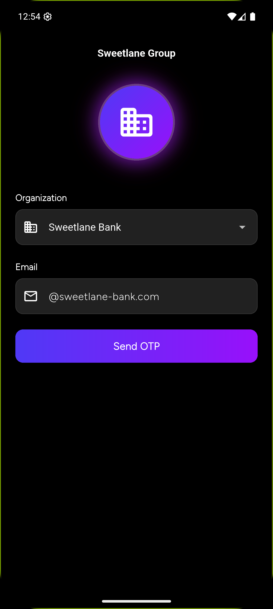
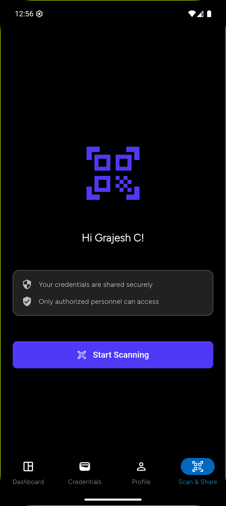
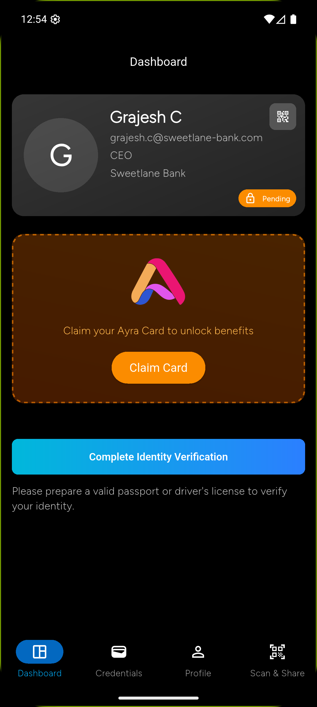
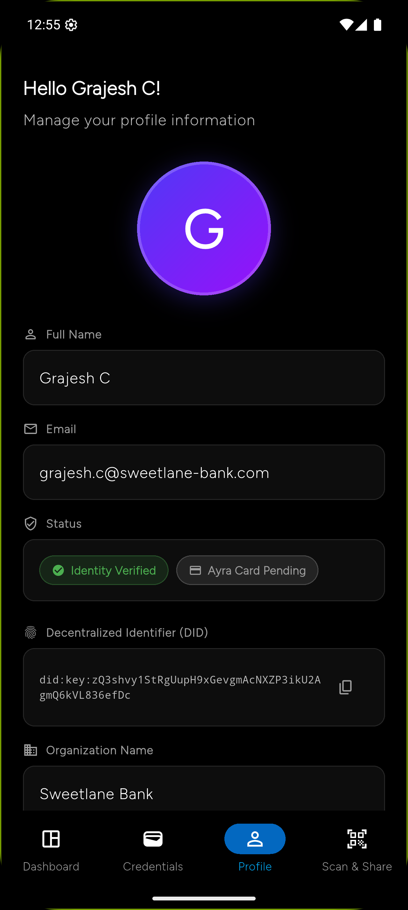
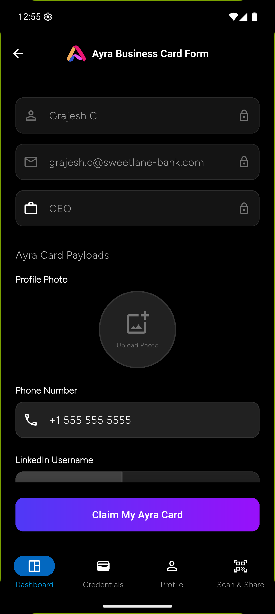
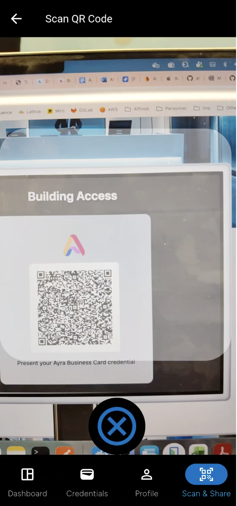
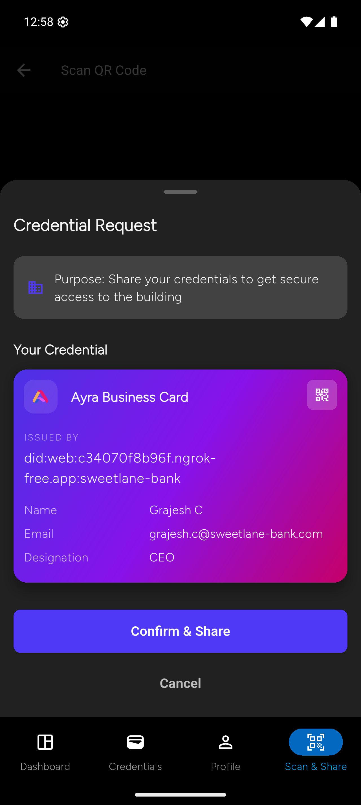

# Ayra Card Demonstration, Powered by Affinidi Trust Infrastructure
 
This repository showcases [the Ayra Card](https://docs.ayra.forum/ayra-cards), a digital credential idea developed and overseen by [the Ayra Association](https://ayra.forum/about/). The Ayra Association is a Swiss non-profit, multi-stakeholder foundation that acts as the governing body for the Ayra Trust Network dedicated to growth of safe, secure, interoperable, and sustainable digital trust ecosystems that connect and enrich our world.
 
Affinidi is [a strategic member of the Ayra Association](https://ayra.forum/members/), offering Affinidi Trust Infrastructure (ATI), which includes a collection of open-source features that help developers quickly and easily realise complex concepts, such as the Ayra Card.
 
This repository provides a practical demonstration of how Ayra Cards can be received, stored, and presented across various systems. The applications are made up of composable components—modular building blocks that developers can expand or adapt. This repository provides automated setup and orchestration of all required services using Docker containers, enabling a complete end-to-end experience in a few minutes. With Affinidi Trust Infrastructure, complexity is minimised and innovation speeds up: you can create new trust networks in just days, not months.


## 🎯 Overview

This project implements a complete digital credential infrastructure based on W3C Verifiable Credentials standards, featuring:

- **Decentralized Identity**: DID:web based identifiers for organizations
- **Verifiable Credentials**: Issue and verify employment and business card credentials
- **Trust Registry**: Implements Trust Registry Query Protocol (TRQP) specification
- **Mobile Wallet**: Flutter-based mobile app with secure credential storage
- **Verification Scenarios**: Multiple real-world credential verification use cases

## Affinidi Components

This POC leverages several Affinidi components and protocols to build a complete verifiable credential ecosystem:

| Component                                    | Resources                                                                                                                                                                                                                                                                                                                |
| -------------------------------------------- | ------------------------------------------------------------------------------------------------------------------------------------------------------------------------------------------------------------------------------------------------------------------------------------------------------------------------ |
| **Affinidi TDK Vault**                       | [GitHub Repository](https://github.com/affinidi/affinidi-tdk), [Documentation](https://docs.affinidi.com/dev-tools/affinidi-tdk/), [pub.dev](https://pub.dev/packages/affinidi_tdk_vault), [Reference Application](https://github.com/affinidi/affinidi-tdk-vault-reference-app)                                         |
| **Affinidi Meeting Place SDK**               | [GitHub Repository](https://github.com/affinidi/affinidi-meetingplace-sdk-dart), [Documentation](https://docs.affinidi.com/products/affinidi-messaging/meeting-place/), [pub.dev](https://pub.dev/packages/meeting_place_core), [Reference Application](https://github.com/affinidi/affinidi-meetingplace-reference-app) |
| **Affinidi Meeting Place Control Plane API** | [GitHub Repository](https://github.com/affinidi/affinidi-meetingplace-controlplane-api-dart), [Documentation](https://docs.affinidi.com/products/affinidi-messaging/meeting-place/)                                                                                                                                      |
| **DIDComm v2.1**                             | [GitHub Repository](https://github.com/affinidi/affinidi-didcomm-dart), [pub.dev](https://pub.dev/packages/didcomm), [Specification](https://identity.foundation/didcomm-messaging/spec/)                                                                                                                                |
| **Verifiable Data Issuance Protocol (VDIP)** | [GitHub Repository](https://github.com/affinidi/affinidi-tdk/tree/main/libs/dart/didcomm/vdip), [pub.dev](https://pub.dev/packages/affinidi_tdk_vdip), [Documentation](https://github.com/affinidi/affinidi-vdxp-docs)                                                                                                   |
| **Verifiable Data Sharing Protocol (VDSP)**  | [GitHub Repository](https://github.com/affinidi/affinidi-tdk/tree/main/libs/dart/didcomm/vdsp), [pub.dev](https://pub.dev/packages/affinidi_tdk_vdsp), [Documentation](https://github.com/affinidi/affinidi-vdxp-docs)                                                                                                   |
| **Affinidi Trust Registry**                  | [GitHub Repository](https://github.com/affinidi/affinidi-trust-registry-rs)                                                                                                                                                                                                                                              |

### Mobile Wallet Experience

<p align="center">
  
  
  
  
</p>

<p align="center">
  <em>From login to credential sharing - Complete mobile wallet experience</em>
</p>

## 📋 Prerequisites

Before starting, ensure you have the following installed and configured:

### Required Software

- **Docker Desktop** (v20.10+) - Running with Compose plugin
  - [Install Docker Desktop](https://www.docker.com/products/docker-desktop/)
  - Ensure Docker daemon is running
- **Node.js** (v18+) and npm - For domain setup automation
  - [Install Node.js](https://nodejs.org/)
- **Flutter SDK** (v3.0+) - To build and run the mobile app
  - [Install Flutter](https://docs.flutter.dev/get-started/install)
- **Git** - For cloning the Trust Registry API repository (GitHub)

### Required Accounts & Credentials

- **ngrok Account** - For public domain tunneling

  - [Sign up for ngrok](https://dashboard.ngrok.com/signup)
  - Get your [auth token](https://dashboard.ngrok.com/get-started/your-authtoken)
  - Free tier is sufficient for development

- **Affinidi Services** - Pre-configured before setup
  - **DIDComm Mediator**: Follow [this guide](https://docs.affinidi.com/products/affinidi-messaging/didcomm-mediator/)
  - **Meetingplace Control Plane**: Follow [these steps](https://docs.affinidi.com/products/affinidi-messaging/meeting-place/)

### System Requirements

- **Operating System**: macOS, Linux, or Windows with WSL2
- **RAM**: Minimum 8GB (16GB recommended for running all services)
- **Disk Space**: At least 10GB free space
- **Network**: Stable internet connection for Docker pulls and ngrok tunnels

## System Components

### 1. Domain Setup

Automatically generates public domains using ngrok tunnels for the Issuer, Verifier, and Trust Registry services. Updates all configuration files with the generated URLs.

### 2. Issuer Portal

A Dart-based server that:

- Generates DID:web identifiers for organizations
- Issues employment credentials
- Issues Ayra business card credentials using [VDIP protocol](https://github.com/affinidi/affinidi-vdxp-docs)

### 3. Trust Registry API

Implements the [Trust Registry Query Protocol (TRQP)](https://trustoverip.github.io/tswg-trust-registry-protocol/#introduction) specification using [Affinidi's open-source implementation](https://github.com/affinidi/affinidi-trust-registry-rs). Maintains trusted issuer and credential type registrations.

### 4. Trust Registry UI

Web-based interface for testing and interacting with Trust Registry APIs.

### 5. Verifier Portal

A Dart server implementing the [VDSP protocol](https://github.com/affinidi/affinidi-vdxp-docs) with multiple verification scenarios:

- **Building Access** - Verify credentials for building entry
- **6th Floor Session** - Secure area access for roundtable sessions
- **Hotel Check-in** - Fast check-in with identity credentials
- **Coffee Shop** - Exclusive discounts with Ayra card

Each scenario generates a QR code that employees scan with the mobile app to share their credentials.

### 6. Mobile App

Flutter-based mobile application using Affinidi Meetingplace SDK and TDK for secure credential storage. Features:

- **Login** - Organization selection with email + OTP authentication
- **Credential Issuance** - Receive employment credentials via VDIP
- **Ayra Card Claiming** - Customize and request business card credentials
- **Scan & Share** - Scan QR codes and share credentials via VDSP

## Quick Start

### 1. Configure Environment

**Setup Required Services:**

Before running the setup, ensure you have configured:

- **DIDComm Mediator**: Follow [this guide](https://docs.affinidi.com/products/affinidi-messaging/didcomm-mediator/)
- **Meetingplace Control Plane**: Follow [these steps](https://docs.affinidi.com/products/affinidi-messaging/meeting-place/)

## 🏗️ Architecture

This project consists of six interconnected components:

```
┌─────────────────┐     ┌──────────────────┐     ┌─────────────────┐
│  Mobile Wallet  │────▶│  Issuer Portal   │────▶│ Trust Registry  │
│   (Flutter)     │     │   (VDIP/DID)     │     │   API (TRQP)    │
└─────────────────┘     └──────────────────┘     └─────────────────┘
         │                                                 │
         │                                                 │
         ▼                                                 ▼
┌─────────────────┐                              ┌─────────────────┐
│ Verifier Portal │◀─────────────────────────────│ Trust Registry  │
│     (VDSP)      │                              │       UI        │
└─────────────────┘                              └─────────────────┘
         ▲
         │
   ┌─────────────┐
   │   ngrok     │
   │  Tunnels    │
   └─────────────┘
```

### Trust Triangle

<p align="center">
  
</p>

<p align="center">
  <em>The trust triangle showing the relationships between Issuer, Verifier, Holder, and Trust Registries</em>
</p>

### Architecture Overview

<p align="center">
  
</p>

<p align="center">
  <em>High-level architecture diagram showing the components involved and their interactions/flows</em>
</p>

### Component Details

| Component              | Technology       | Port | Purpose                                 |
| ---------------------- | ---------------- | ---- | --------------------------------------- |
| **Domain Setup**       | Node.js, ngrok   | N/A  | Generates public domains via tunnels    |
| **Issuer Portal**      | Dart             | 8080 | Issues verifiable credentials (VDIP)    |
| **Trust Registry API** | Rust             | 3232 | TRQP-compliant trust registry           |
| **Trust Registry UI**  | TypeScript/React | 3000 | Web interface for trust registry        |
| **Verifier Portal**    | Dart             | 8081 | Verifies credentials (VDSP)             |
| **Mobile App**         | Flutter/Dart     | N/A  | Mobile wallet for credential management |

## 🚀 Quick Start Guide

### Step 1: Get the Repository

```bash
cd ayra-e2e-setup
```

**Note**: The repository includes all component code in their respective `code/` folders (issuer-portal, verifier-portal, trust-registry-ui, mobile-app). Only the Trust Registry API will be cloned from GitHub during setup.

### Step 2: Configure Prerequisites

Before running setup, ensure you have:

1. **DIDComm Mediator** configured - [Setup Guide](https://docs.affinidi.com/products/affinidi-messaging/didcomm-mediator/)
2. **Meetingplace Control Plane** configured - [Setup Guide](https://docs.affinidi.com/products/affinidi-messaging/meeting-place/)
3. **ngrok auth token** - Get from [ngrok dashboard](https://dashboard.ngrok.com/get-started/your-authtoken)

### Step 3: Run the Setup Script

The setup script automates the entire configuration process:

```bash
chmod +x setup-ayra.sh
./setup-ayra.sh
```

**What the script does:**

- Creates `.env` file from `.env.example` if not present
- Prompts for required credentials (`SERVICE_DID`, `MEDIATOR_DID`, `NGROK_AUTH_TOKEN`)
- Clones Trust Registry API repository from GitHub (only external dependency)
- Runs individual setup scripts for each component
- Generates ngrok tunnels and updates all configurations
- Prepares services for deployment

**Interactive Prompts:**

```
⚠️  SERVICE_DID is not set in .env file
Please enter SERVICE_DID: did:web:example.com:service

⚠️  MEDIATOR_DID is not set in .env file
Please enter MEDIATOR_DID: did:web:example.com:mediator

⚠️  NGROK_AUTH_TOKEN is not set in .env file
Please enter NGROK_AUTH_TOKEN: 2abc...xyz
```

### Step 4: Start All Services

Launch the entire stack using Docker Compose:

```bash
docker compose up -d --force-recreate
```

**Verify services are running:**

```bash
docker compose ps
```

You should see all services in "Up" state:

- `issuer-portal`
- `verifier-portal`
- `trust-registry-api`
- `trust-registry-ui`

### Step 5: Configure and Run Mobile App

```bash
cd mobile-app/code

# Install Flutter dependencies
flutter pub get

# Run on connected device or emulator
flutter run --dart-define-from-file=configurations/.env
```

**Note:** Ensure you have an Android/iOS device connected or emulator running.

## 📝 Configuration

### Environment Variables

The `.env` file contains all configuration settings. Key variables:

```bash
# Ngrok Configuration
USE_NGROK=true                        # Enable/disable ngrok tunneling
NGROK_AUTH_TOKEN=your_token_here      # Your ngrok authentication token

# Trust Registry API Repository (only external dependency cloned during setup)
TRUST_REGISTRY_API_REPO_URL="https://github.com/affinidi/affinidi-trust-registry-rs"

# Component code is included in the repository under respective 'code/' folders:
# - issuer-portal/code/
# - verifier-portal/code/
# - trust-registry-ui/code/
# - mobile-app/code/

# Affinidi Services
SERVICE_DID=                          # Meetingplace control plane DID
MEDIATOR_DID=                         # DIDComm Mediator DID

# Issuer Configuration
ALLOWED_EMAIL_DOMAIN=sweetlane-bank,affinidi
ISSUER_DIDWEB_DOMAIN=                 # Auto-configured by setup
ECOSYSTEM_DIDWEB_DOMAIN=              # Auto-configured by setup
AYRA_DIDWEB_DOMAIN=                   # Auto-configured by setup

# Trust Registry
TR_API_ENDPOINT=                      # Auto-configured by setup
TR_STORAGE_BACKEND=csv
TR_FILE_STORAGE_PATH=/data/tr-data.csv

# Mobile App
APP_VERSION_NAME="Panther"
```

### Manual Configuration (Alternative to ngrok)

If you prefer to use your own tunneling solution or have static domains:

1. Set `USE_NGROK=false` in `.env`
2. Manually configure domain URLs in:
   - `issuer-portal/code/.env`
   - `verifier-portal/code/.env`
   - `trust-registry-ui/code/src/data/registries.ts`
   - `mobile-app/code/configurations/.env`

## 🎮 Usage Guide

### Issuer Portal Workflows

The Issuer Portal provides two main credential issuance workflows:

1. **Employment Credential Issuance**

   - Organizations can issue employment credentials to their employees
   - Credentials include employee details, role, and organization information
   - Uses VDIP (Verifiable Data Issuance Protocol)

2. **Ayra Business Card Issuance**
   - Employees can claim personalized business cards
   - Customizable with personal information and preferences
   - Linked to organization's DID:web identifier

**Access:** `https://<issuer-domain>` (generated by ngrok)

### Verifier Portal Scenarios

The Verifier Portal implements four verification scenarios:

1. **🏢 Building Access**

   - Verify employee credentials for building entry
   - Checks employment status and organization

2. **🎯 6th Floor Session**

   - Secure area access for roundtable sessions
   - Validates specific credential attributes

3. **🏨 Hotel Check-in**

   - Fast check-in with identity credentials
   - Streamlined guest verification

4. **☕ Coffee Shop**
   - Exclusive discounts with Ayra card
   - Loyalty program integration

**Access:** `https://<verifier-domain>` (generated by ngrok)

### Mobile App Features

#### 1. 🔐 Login

- Organization selection
- Email + OTP authentication (Simulated)

<p align="center">
  
  
  
</p>

#### 2. 📇 Credential Management

- Receive and store credentials securely
- View credential details
- Manage credential lifecycle

<p align="center">

  

</p>

#### 3. 🎫 Ayra Card Claiming

- Customize business card appearance
- Request credential issuance
- Share card with others

<p align="center">
  
  
</p>

#### 4. 📱 Scan & Share

- Scan QR codes from verifier portals
- Select credentials to share
- Authorize credential presentation

<p align="center">
  
  
  
  
  
</p>

#### 5. 🔍 Identity Verification

- Biometric authentication support
- Secure identity verification flows

<p align="center">
  
</p>

### Trust Registry

**API Access:** `http://localhost:3232` (or ngrok URL)

**UI Access:** `http://localhost:3000` (or ngrok URL)

**Functions:**

- Register trusted issuers
- Manage credential schemas
- Query issuer trustworthiness
- Implement TRQP protocol endpoints

## 🔧 Development Workflow

### Component Setup Details

Each component has its own setup script that:

| Component              | Setup Actions                                                                                 |
| ---------------------- | --------------------------------------------------------------------------------------------- |
| **domain-setup**       | Installs npm dependencies, starts ngrok tunnels, generates `domains.json` with public URLs    |
| **issuer-portal**      | Clones repository, updates `.env` with domains and DIDs                                       |
| **verifier-portal**    | Clones repository, configures VDSP endpoints                                                  |
| **trust-registry-api** | Clones repository, generates `tr-data.csv` with issuer domains                                |
| **trust-registry-ui**  | Clones repository, updates `registries.ts` with API endpoints                                 |
| **mobile-app**         | Clones repository, configures `.env`, updates organization endpoints, copies Firebase configs |

### Viewing Service Logs

```bash
# All services
docker compose logs -f

# Specific service
docker compose logs -f issuer-portal
docker compose logs -f verifier-portal
docker compose logs -f trust-registry-api
```

### Rebuilding Services

```bash
# Rebuild all services
docker compose up -d --build --force-recreate

# Rebuild specific service
docker compose up -d --build issuer-portal
```

### Stopping Services

```bash
# Stop all services
docker compose down

# Stop and remove volumes
docker compose down -v
```

## 🧹 Cleanup

To remove cloned repositories and generated data:

```bash
chmod +x cleanup.sh
./cleanup.sh
```

**This will remove:**

- Trust Registry API `code` directory (cloned from GitHub)
- All `data` directories (generated data)
- Docker containers and volumes

**Note:** The `.env` file and component `code/` folders (issuer-portal, verifier-portal, trust-registry-ui, mobile-app) are preserved as they are part of the repository.

## 📚 Additional Documentation

Detailed documentation for each component:

- [Domain Setup](./domain-setup/README.md) - ngrok tunnel configuration
- [Issuer Portal](./issuer-portal/README.md) - Credential issuance setup
- [Trust Registry API](./trust-registry-api/README.md) - TRQP implementation
- [Trust Registry UI](./trust-registry-ui/README.md) - Web interface setup
- [Verifier Portal](./verifier-portal/README.md) - Verification scenarios
- [Mobile App](./mobile-app/README.md) - Flutter app configuration

## Demo Video

Watch the complete Ayra demo in action:

[](https://www.youtube.com/watch?v=PwSsXNuUFR0)

[▶️ Watch on YouTube](https://www.youtube.com/watch?v=PwSsXNuUFR0)

## 🔒 Security Considerations

**For Development/Demo Use Only**

This setup is designed for development and demonstration purposes. For production deployment:

- Use proper secret management (not `.env` files)
- Implement proper authentication and authorization
- Use production-grade databases (not CSV files)
- Enable HTTPS everywhere
- Implement rate limiting and DDoS protection
- Use dedicated infrastructure (not ngrok)
- Follow security best practices for each component
- Regular security audits and updates

## 📖 Protocol References

- [VDIP - Verifiable Data Issuance Protocol](https://github.com/affinidi/affinidi-vdxp-docs)
- [VDSP - Verifiable Data Sharing Protocol](https://github.com/affinidi/affinidi-vdxp-docs)
- [TRQP - Trust Registry Query Protocol](https://trustoverip.github.io/tswg-trust-registry-protocol/)
- [W3C Verifiable Credentials](https://www.w3.org/TR/vc-data-model/)
- [DID:web Method Specification](https://w3c-ccg.github.io/did-method-web/)

## 🤝 Contributing

When contributing to this repository:

1. Fork the repository
2. Create a feature branch
3. Make your changes
4. Test thoroughly with the full stack
5. Submit a pull request with clear description

## 📄 License

See [LICENSE](./LICENSE) file for details.

## 📞 Support

For issues and questions:

- Open an issue in this repository
- Check Affinidi documentation: https://docs.affinidi.com
- Review individual component repositories

## 🙏 Acknowledgments

This project uses open-source implementations from:

- Affinidi Trust Registry (Rust implementation)
- Affinidi Verifiable Data Protocols
- ngrok tunneling service
- Docker containerization platform

---

**Note:** Remember to keep your ngrok terminal running while using the services. The public URLs generated by ngrok will become unavailable if you close that terminal.
